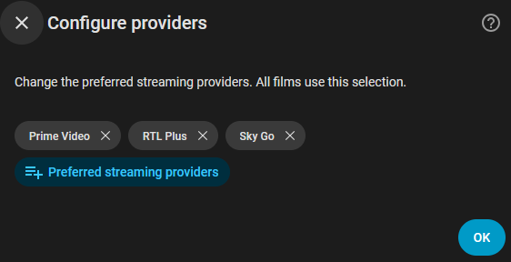
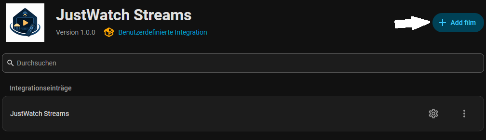
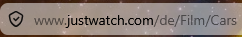
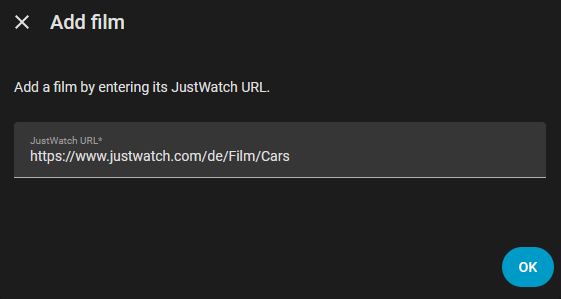
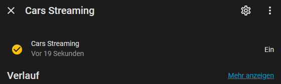
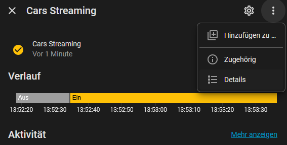
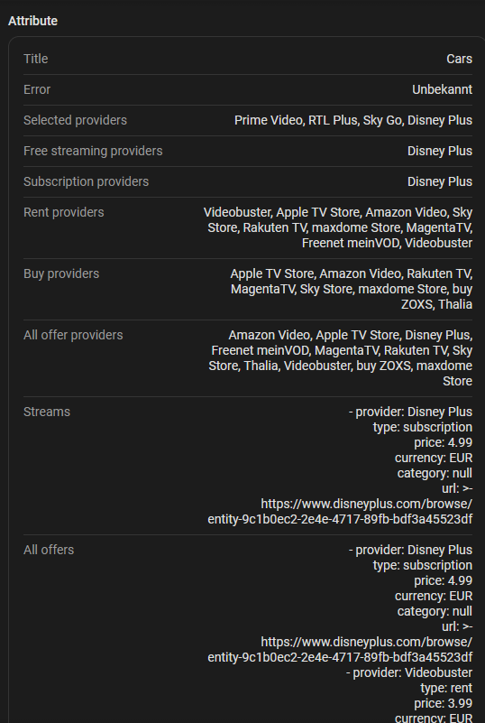

# JustWatch Streams

  

Home Assistant custom integration that keeps track of when your favorite films become available on the streaming services you actually use.

Instead of manually checking multiple platforms, this integration monitors JustWatch and creates sensors in Home Assistant for each film. You can use them in dashboards, notifications, or automations to instantly know when a movie becomes available on one of your preferred providers.

> [!TIP]
> **Use Case (Automations & Notifications):** Since each film is represented as a standard binary sensor in Home Assistant, you can easily set up automations! For example, you can create an automation that triggers when a film's state changes from `off` to `on` and sends a push notification to your mobile phone, so you instantly know when it becomes available on one of your preferred streaming services.

## Installation (HACS)

*(Since this integration is not in the default HACS repository list, the button above will open your Home Assistant instance and prompt you to add it as a custom repository).*

### Manual Installation

If the button doesn't work, you can add it manually:

1. Open **HACS** in Home Assistant.
2. Go to **Integrations**.
3. Click **⋮ → Custom repositories** (top right corner).
4. Add `https://github.com/Renegaded66/justwatch_streams` as a custom repository and select **Integration** as the category.
5. Click **Add**.
6. Search for **JustWatch Streams** in HACS and install it.
7. Restart Home Assistant.

After restarting:

1. Go to **Settings > Devices & services > Add integration**.
2. Add **JustWatch Streams** to start the setup.

---

## Setup & Configuration

### 1. Select Preferred Providers
When you first configure the integration, you will be prompted to select your preferred streaming providers. These are the subscription-based services you actually use. By default, none are selected, so you can choose exactly the ones you want.

You can modify your preferred providers at any time later by clicking **Configure providers** on the integration page.

*Only one main JustWatch Streams service can be configured.*

### 2. Add Films
To track when your favorite films become available:

1. Open the **JustWatch Streams** integration entry in Home Assistant.
2. Click the **Add film** button.
   
3. Go to the [JustWatch website](https://www.justwatch.com), search for your desired film, and copy the browser URL.
   
4. Paste the URL into the Home Assistant dialog and click **Submit**.
   

### 3. Monitoring Availability
Each added film creates a binary sensor in Home Assistant:
- **`on` (Available)**: The film is available on at least one of your preferred subscription providers.
- **`off` (Not Available)**: The film is not available on any of your selected subscription providers.

### 4. Viewing Details & Attributes
You can easily see where a film is currently streaming, renting, or buying:

1. Click on the film sensor to open the details dialog.
   
2. Look at the attributes under the details info to see exactly which services have the film available.
   

#### Exposed Attributes:
- `free_streaming_providers`: Selected subscription providers where the film is available.
- `subscription_providers`: All subscription providers found on JustWatch.
- `rent_providers`: Providers where the film can be rented.
- `buy_providers`: Providers where the film can be bought.
- `all_offers`: Parsed offer details including type, price, currency, and URL.

---

## Updates

Films are refreshed when Home Assistant starts and every day at `00:00` local Home Assistant time.

## Notes

JustWatch page structure can change. This integration currently parses the structured JSON-LD data embedded in the film page.

<small>*Note: Currently, this integration has only been tested and confirmed to work in Germany. Other country domains have not been tested yet.*</small>

---

## Disclaimer

**Please read this carefully:**
The author of this integration is not responsible for its usage or any consequences thereof. This integration scrapes data directly from the JustWatch website, which may violate their Terms of Service. Use this software at your own risk.
